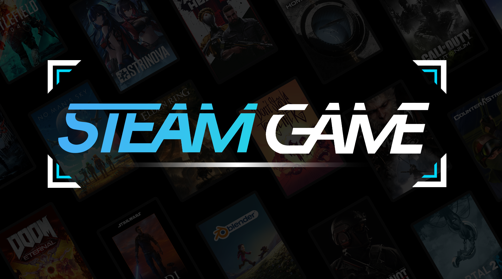
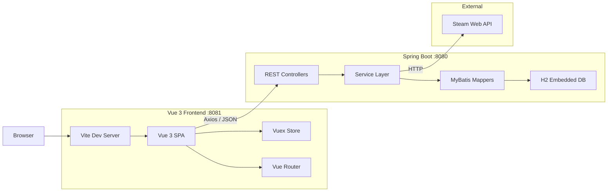
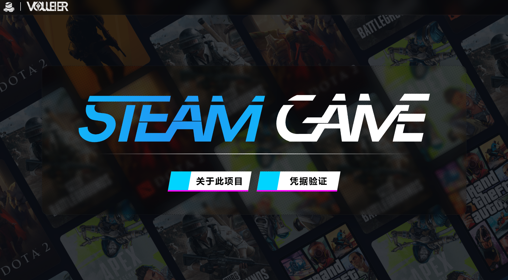
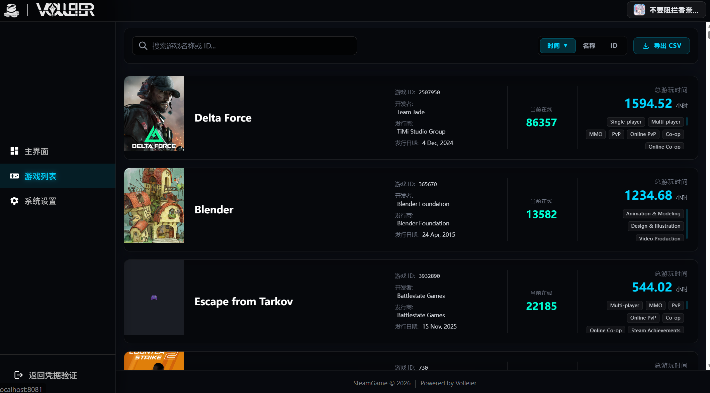
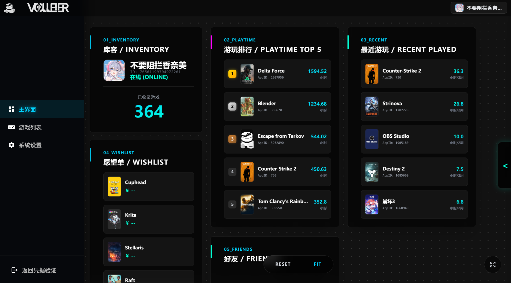

<p align="center">
  <h1 align="center">SteamGame</h1>
  <p align="center">
    <strong>Record, sync, and explore your Steam game library with a self-hosted dashboard.</strong>
  </p>
  <p align="center">
    <a href="https://www.java.com/"></a>
    <a href="https://spring.io/projects/spring-boot"></a>
    <a href="https://vuejs.org/"></a>
    
    
    
    
    
    
  </p>
</p>

<p align="center">
  
</p>

---

SteamGame is a full-stack, self-hosted web dashboard that connects to the Steam Web API, syncs your game library and metadata, and displays them through a sleek, responsive Vue 3 interface. Credentials are encrypted with AES-256-GCM when stored statically. The backend runs on Java 21 and Spring Boot 3.4, and comes with a built-in H2 database—no external database server needed.

## Tech Stack

| Layer          | Technology                               |
| -------------- | ---------------------------------------- |
| **Runtime**    | Java 21                                  |
| **Framework**  | Spring Boot 3.4 (Web, Validation)        |
| **ORM**        | MyBatis 3.0                              |
| **Database**   | H2 (embedded, file-based)                |
| **Security**   | AES-256-GCM credential encryption        |
| **Build**      | Apache Maven (multi-module reactor)      |
| **Frontend**   | Vue 3 (Composition API) + TypeScript 5.8 |
| **State**      | Vuex 4                                   |
| **Routing**    | Vue Router 4                             |
| **Bundler**    | Vite 4                                   |
| **CSS**        | Tailwind CSS 3.4 + SCSS                  |
| **HTTP**       | Axios                                    |
| **Testing**    | JUnit 5 + MyBatis Test                   |
| **Formatting** | Prettier                                 |

## Architecture



## Screenshots

<p align="center">
  
  
  
</p>

## Deployment

### Prerequisites

- **Java 21** on `PATH`
- **Node.js 18+** and **npm**
- **Maven Wrapper** is included — no global Maven install needed

### 1. Clone the repo

```bash
git clone https://github.com/Volleier/SteamGame.git
cd SteamGame
```

### 2. Build & launch

```bat
Build.bat
```

This single script handles everything:

1. Builds the backend with Maven (skipping tests)
2. Stops any previously running instance
3. Starts the Spring Boot backend on **port 8080**
4. Auto-installs frontend dependencies if `node_modules/` is missing
5. Starts the Vite dev server on **port 8081** (proxies `/api` → `localhost:8080`)

### 3. Configure credentials

Open `http://localhost:8081` in your browser, navigate to **Credential Config**, and enter your Steam Web API key and Steam ID. Credentials are encrypted with AES-256-GCM and stored in `auth.yaml`.

## Repository Layout

```
SteamGame/
├── steam-common/         # Shared DTOs, error handling, utilities
├── steam-login/          # Credential encryption, validation, scheduling
├── steam-api/            # Steam Web API client, game sync, REST controllers
├── steam-admin/          # Admin management endpoints
├── steam-launcher/       # Sole executable entry point (packs all modules)
├── vue/                  # Vue 3 + TypeScript + SCSS frontend
│   ├── src/api/          # Axios API layer
│   ├── src/components/   # Reusable UI components
│   ├── src/composables/  # Composition API hooks
│   ├── src/features/     # Feature modules (dashboard, games)
│   ├── src/router/       # Vue Router configuration
│   ├── src/store/        # Vuex store modules
│   └── src/views/        # Page-level views
├── docs/                 # API documentation
├── auth.yaml             # Encrypted credentials (git-ignored)
└── Build.bat             # One-click build & launch script
```

## Requirements

- **Java 21** — required by the backend
- **Node.js 18+** — for the Vue frontend
- **Windows 10/11** — the bundled scripts use Windows paths; adapt for Linux/macOS
- A **Steam Web API key** ([get one here](https://steamcommunity.com/dev/apikey))
